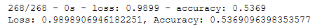

# Neural_Network_Charity_Analysis

## Resources
Python Tensorflow 2.6.0

## Overview

This analysis seeks to evaluate the risk of various donation recipients.  Specifically, it seeks to predict which organization are worthy beneficiaries, and which are of too high a risk.

## Results

In summary:
- IS_SUCCESSFUL is the target of the model.
- Independent variables are:
	Affiliation
	Classification
	Use_Case
	Organization
	Status
	Income_Amt
	Special_Considerations
	Ask_Amt
- "Special_Considerations" and "Status" were both removed, serially and in combination.
	Remove Special considerations:
		Accuracy = 73%.  No improvement.
		

[Fig6: Special Considerations Removal](other_resources/06_drop_special_considerations.png?raw=true "Fig6: Special Considerations Removal")
		
		
	Remove Status:
		Accuracy = 73%.  No improvement.
		
		
		[Fig7: Status Removal](other_resources/07_drop_status.png?raw=true "Fig7: Status Removal")
		

	Remove Both:
		Accuracy = 74%.  Slight improvement.
		
		
		[Fig8: Status and Special Considerations Removal](other_resources/08_drop_special_considerations_and_status.png?raw=true "Fig8: Status and Special Considerations Removal")

- The neural network was selected according to the logic below: 

[Fig1: 8/5 Hidden Layers with 50 epochs](other_resources/01.Accuracy.png?raw=true "Fig1: 8/5 Hidden Layers with 50 epochs")

The first neural network run was comprised of 8 neurons in the first hidden layer and 5 in the second, running for 50 epochs.  Figure 1 shows the accuracy to have been 52%.

[Fig2: 8/5 Hidden Layers with 100 epochs](other_resources/02.Accuracy.png?raw=true "Fig2: 8/5 Hidden Layers with 100 epochs")

To improve performance, the second iteration increased the number of epochs to 100, while keeping the number of neurons consistent.  Performance marginally improved to 53%.

[Fig3: 8/5/5/5 Hidden Layers with 100 epochs](other_resources/03.Accuracy.png?raw=true "Fig3: 8/5/5/5 Hidden Layers with 100 epochs")

In the third iteration the depth of the hidden layers was increased, with 5 additional neurons added in a new third and fourth layer, again running with 100 epochs.  The increased depth drove performance down to 37%.  

[Fig4: 100/80 Hidden Layers with 100 epochs](other_resources/04.Accuracy.png?raw=true "Fig4: 100/80 Hidden Layers with 100 epochs")

For the fourth iteration, the number of neurons in the first and second hidden layers was increased to 100 and 80 respectively, and the third and fourth layers were removed.  Again this model was run with 100 epochs.  The performance increase over the original 8/5 neurons was marginal, at 54%. 

[Fig5a: Optimized 20 epochs Accuracy](other_resources/05b.Accuracy?raw=true "Fig5a: Optimized 20 epochs Accuracy")

Switching to an optimization algorithm, we obtain an accuracy of 73%.  While we're unable to achieve the target accuracy of 75%, this is a drastic improvement over the relu / sigmoid models with no variation in input layers.  Increasing the number of epochs in this model does not positively impact the performance.

[Fig5b: Optimized 20 epochs Model](other_resources/05b.Optimized_Model.png?raw=true "Fig5b: Optimized 20 epochs Model")

This model is indicated to have 7 input units, with 7 hidden layers, with the number of neurons in each layer as indicated in Figure 5b.

[Fig5c: Optimized 20 epochs Model](other_resources/05b.Optimized_Model.png?raw=true "Fig5c: Optimized 20 epochs Model")

Figure 5c shows the degrees of freedom afforded the optimizer.  First units are allowed to be anywhere between 1 and 8, with any of relu, tanh, or sigmoid as activation functions.  The number of hidden layers can be anywhere between 1 and 8 deep, with each layer between 1 and 50 neurons. 

## Summary

Ultimately, the model was unable to achieve a 75% accuracy rate, though it came close by using an optimizer with a good deal of latitude.  Even more improvement is made by dropping select factors, but not enough to achieve the 75% threshold.  A random forest classifier model will likely be more appropriate for this challenge, as its simplicity will likely outperform the costs of the deep neural network. 
